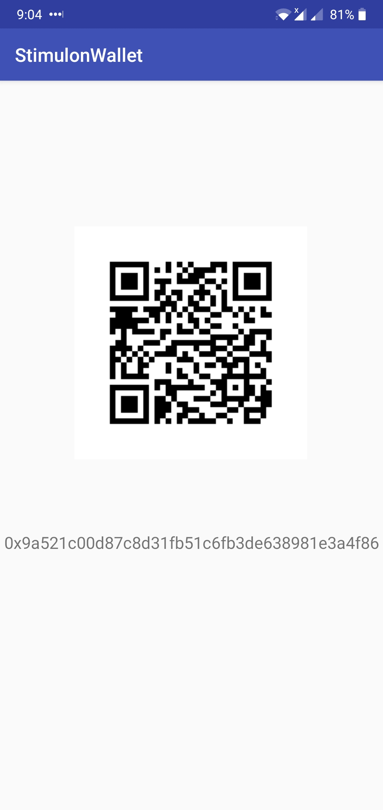

## StimulonWallet
An android wallet for [Stimulon](https://github.com/cvhariharan/Stimulon) ERC-20 tokens developed for [Stimulus](https://github.com/Studio-7/Stimulus-Doc), which is a decentralized news platform. This app can be used to send and receive Stimulon tokens. 

### Screenshots
#### Login

  

#### Send Tokens

  

'

#### Receive Tokens

  

